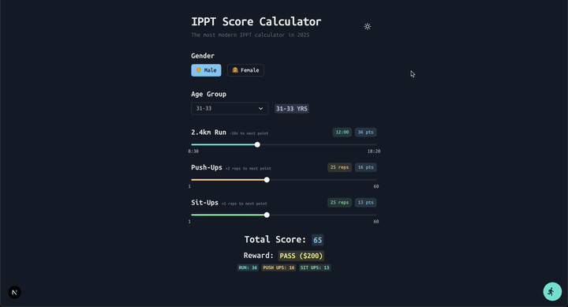

# [IPPT Calculator](https://ippt.davidcjw.com)

[](https://github.com/davidcjw/ippt-calculator/actions/workflows/ci.yml)

[](LICENSE)
[](https://agentready.davidcjw.com/results/davidcjw/ippt-calculator)

<p align="center">
  
</p>

A modern web app to calculate your Individual Physical Proficiency Test (IPPT) score for Singapore Armed Forces (SAF), Home Team, and related organizations.

## Installation

```bash
git clone https://github.com/davidcjw/ippt-calculator.git
cd ippt-calculator
npm install
npm run dev
```

Open [http://localhost:3000](http://localhost:3000) in your browser.

## What is IPPT?

The Individual Physical Proficiency Test (IPPT) is Singapore's national fitness test for servicemen and servicewomen. It consists of three stations:
- **Push-Ups** (maximum reps in 1 minute)
- **Sit-Ups** (maximum reps in 1 minute)
- **2.4km Run** (timed)

Scores are awarded for each station based on age group and gender, and the total score determines your award tier (Fail, Pass, Silver, Gold) and monetary incentives.

## About This App

This app allows you to:
- Select your gender and age group
- Adjust your push-up, sit-up, and 2.4km run performance using sliders
- Instantly see your score for each station, total score, and the corresponding award/incentive
- Explore how many more reps or how much faster you need to improve your score

All scoring is based on the latest official IPPT tables for 2025.

## IPPT Workout Progress Tracker

You can now track your IPPT workouts directly in the app using a floating drawer:

- Click the running man icon (bottom right) to open the "Track Progress" drawer.
- Click "Add Workout" to log a new workout.
- Enter your 2.4KM run timing, push up count, and sit up count using the provided inputs.
- The app will automatically calculate your total points and result (e.g., Pass, Silver, Gold) using the same logic as the main calculator.
- Click "Save Workout" to store your entry. Your gender and age group are also saved.
- All workouts are saved in your browser's localStorage and will persist across sessions.
- You can view, delete, and manage your workout history in the drawer at any time.

### Features
- Floating button with animated icon and text for easy access.
- Compact, user-friendly form with dropdowns and time pickers.
- Automatic score calculation and result display.
- LocalStorage-based persistence (no account required).
- Delete individual workouts as needed.

## Contributing

Contributions are welcome! Please open an issue first to discuss what you'd like to change.

1. Fork the repo
2. Create a feature branch (`git checkout -b feature/your-feature`)
3. Commit your changes (`git commit -m 'feat: describe change'`)
4. Push and open a pull request

For bug reports or feature requests, please open them [here](https://github.com/davidcjw/ippt-calculator/issues).

Please run `npm run lint` before submitting a PR.

## Code of Conduct

This project follows the [Contributor Covenant v2.1](https://www.contributor-covenant.org/version/2/1/code_of_conduct/).
By participating you agree to uphold a welcoming, harassment-free environment.

## License

Distributed under the MIT License. See [LICENSE](LICENSE) for details.
